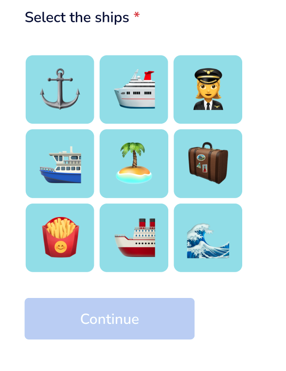
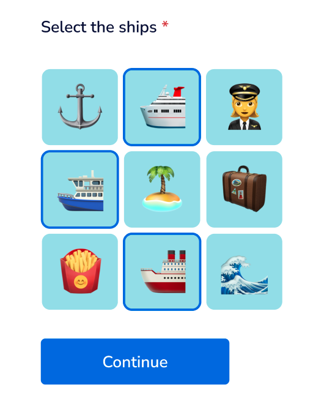

# Tray frontend coding challenge

See the app here: [https://wonderful-shannon-d5576b.netlify.app/](https://wonderful-shannon-d5576b.netlify.app/)

## "Sailorgate"

Your local sailing club has asked you to implement a re-captcha to ensure only true sailors can access the site.

## User flow

1. While captcha data is loading, users should see some sort of loading indicator
2. When a challenge has been successfully retrieved, users should be asked to identify the images containing ships
   - the images should be shown in the order specified by the API
   - the images should be arranged in a 3x3 grid
   - the first row should display the first three images, and so on



3. Users should be able to select and deselect individual images
   - in order to continue, at least one image must be selected



4. When the users choose to **Continue**, their selection should be validated by the API.
   - the UI should be cleared, and a loading indicator should be displayed.
   - API errors and retries should not be noticed by the user
5. Depending on the outcome, the following should occur:
   - if successful, proceed to step 6
   - if unsuccessful, the entire flow should restart from step 1
6. The user should see a welcome message "**⚓️ Welcome aboard!**"

## API

The Sailing Club backend team host their servers on moving cargo ships which makes the APIs
somewhat unreliable in stormy weather... It's pretty stormy out there.

🌩 Expect `500` errors, badly formatted responses, as well as the occasional timeout.

### Step 1 API: Get challenge image sequence

Http method: `GET`

Endpoint: `https://d7758750-0941-418b-8140-07d22dad112a.trayapp.io/?c=your-github-username`

This API expects your github (or other SCM) username as a `GET` parameter `c`.

This API returns a list of nine image filenames to display to the user.\
Note: find the images in the repo inside [assets/ship-detection](assets/ship-detection)

**Response format**

```json
{
  "challenge": [
    "idx2.png",
    "idx7.png",
    "idx3.png",
    "idx0.png",
    "idx6.png",
    "idx1.png",
    "idx5.png",
    "idx8.png",
    "idx4.png"
  ]
}
```

### Step 4 API: Validate user selection

Http method: `POST`

Endpoint: `https://4647db48-f860-4d9d-bc06-beb009d53265.trayapp.io/?c=your-github-username`

This API expects:

- your github (or other SCM) username as a `GET` parameter `c`.
- a list of one or more non-repeating image filenames in the `POST` body (see expected format below).

This API returns a boolean value with the validation outcome.

**Expected format**

```json
{
  "ships": ["idx2.png", "idx7.png", "idx3.png"]
}
```

**Response format**

```json
{
  "validated": true
}
```

## Visual specs

### Font

- https://fonts.google.com/specimen/Nunito+Sans
- size: 14px
- line height: 22px

### Colors of interest

- background: #FFFFFF
- body text: #000000
- "required" asterisk: #D33F3F
- button text: #FFFFFF
- button face
  - enabled: #0D66E5
  - disabled: #BDCCF0
- "selected" image outline: #0D66E5

# Development

This project was bootstrapped with [Create React App](https://github.com/facebook/create-react-app).

In the project directory, you can run:

## `yarn start`

Runs the app in the development mode.\
Open [http://localhost:3000](http://localhost:3000) to view it in the browser.

The page will reload if you make edits.\
You will also see any lint errors in the console.

## `yarn test`

Launches the test runner in the interactive watch mode.

# Assessment

## Rules and recommendations

- ☝️ There's only one unbending rule: you must use React
- ⏲️ Stop after two hours, and document what's missing; your time is precious
- 🛠 You can use whichever tools to build and scaffold the app
- 👼 Pay attention to the UX and gracefully handle API errors and unexpected behaviours
- 🐞 Write meaningful tests that ensure working software (good tests is better than many tests)
- 📦 You shouldn't need third party libraries to implement the desired behaviours but if you do,
  please document why in [NOTES.md](/NOTES.md).

## Our rubric

To remove bias, we use a standardized assessment rubric, focussing on the following factors:

### Writing for others as well as to solve to problem

- Appropriate application of js, css, and html
- Separation of concerns
- Defensive programming
- Understandable code

### Understanding of web fundamentals

- Accessibility
- Semantic markdown
- Scalable and well-structured css

### Accuracy and reliability

- Working software
- Attention to detail
- Meaningful tests

# What's next?

1. Submit your solution either by linking to the repo URL or sending in a zip.
2. Our team will look over your solution using the rubric.
3. Following a successful assessment, we'll meet to discuss parts of your task
   and how it would change to accommodate additional scenarios or changes in behaviour.
